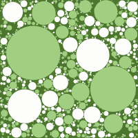

# Imgen

Imgen utilizes patterns and palettes to procedurally generate unique images of
an arbitrary size such as the ones below:





## Example Use

Imgen can be used to generate infinite wallpapers, a simple shell script can
create a image with imgen and then set the wallpaper to that image.

```sh
#!/bin/sh

output="/tmp/imgen.png"
read w h <<< $(xrandr | grep '*' | awk '{print $1}' | awk -Fx '{print $1, $2}')

./imgen -w $w -h $h -d $output
feh --bg-fill $output
```

That script could then be setup as a cron task to create a new, unique wallpaper
every hour.
